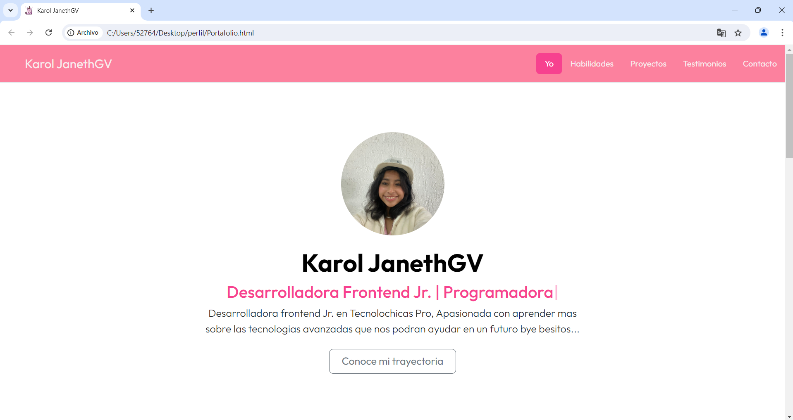

# Portafolio de KarolJaneth 
## Proyecto responsivo realizado con Bootstrap 5

Proyecto creado durante el bootcamp de Tecnolochicas PRO, es adaptable a distintos dispositivos o tamaños de pantalla.
El proposito de esta pagina web es mostrar mi portafolio de proyecto como desarrolladora web.

Podrás encontrarlo aquí [Portafolio](https://github.com/Karol-JanethGV).💚

### Tecnologías

* HTML
* CSS
* Bootstrap 5
* JAVASCRIPT

### El proyecto cuenta con las siguiente secciones:

* Sobre mi
* Habilidades
* Proyectos
* Contacto
### Captura del proyecto
